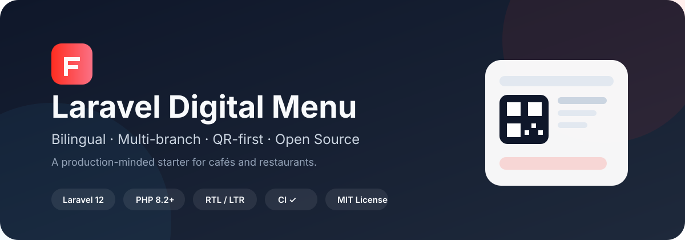

<p align="center">
  
</p>

<p align="center">
  <a href="README.md">English</a> ·
  <a href="docs/ARCHITECTURE.md">Architecture</a> ·
  <a href="docs/ROADMAP.md">Roadmap</a> ·
  <a href="CONTRIBUTING.md">Contributing</a> ·
  <a href="SECURITY.md">Security</a>
</p>

# Laravel Digital Menu

مشروع مفتوح المصدر لبناء **منيو رقمي ثنائي اللغة ومتعدد الفروع للمقاهي والمطاعم** باستخدام Laravel 12.

المشروع يوفر أساسًا عمليًا لمنيو QR مع محتوى عربي وإنجليزي، دعم RTL/LTR، إدارة الفروع والأقسام والمنتجات، والتحكم في توفر العناصر حسب الفرع.

> المستودع مستقل بالكامل ولا يحتوي على بيانات عميل، كلمات مرور، Branding خاص، صور تجارية خاصة، أو بيانات Production.

## المميزات

| الجزء | المتوفر |
| --- | --- |
| Framework | Laravel 12 / PHP 8.2+ |
| اللغات | عربي + إنجليزي |
| الاتجاه | RTL + LTR |
| الفروع | دعم عدة فروع |
| المنيو | أقسام + منتجات |
| قواعد الفرع | التوفر + دعم سعر مختلف حسب الفرع |
| QR | Route خاص بكل فرع |
| لوحة الإدارة | Authentication + CRUD |
| التطوير المحلي | إعداد سهل باستخدام SQLite |
| الجودة | PHPUnit Feature Tests + Laravel Pint |
| CI | GitHub Actions |
| الترخيص | MIT |

## التشغيل السريع

```bash
git clone https://github.com/ayagaidi/laravel-digital-menu.git
cd laravel-digital-menu
composer install
cp .env.example .env
php artisan key:generate
touch database/database.sqlite
php artisan migrate --seed
php artisan serve
```

بعدها افتحي:

```text
http://127.0.0.1:8000
```

## مستخدم Admin تجريبي

المشروع لا يحتوي على Password ثابت داخل الكود. لإنشاء Admin محلي، ضعي القيم في `.env` عندك فقط:

```dotenv
SEED_ADMIN_NAME="Demo Admin"
SEED_ADMIN_EMAIL=admin@example.test
SEED_ADMIN_PASSWORD=change-this-locally
```

ثم شغلي:

```bash
php artisan db:seed
```

## الاختبارات والجودة

```bash
php artisan test
vendor/bin/pint --test
```

GitHub Actions يشغل الاختبارات وفحص Laravel Pint تلقائيًا على الـpush والـpull requests إلى `main`.

الاختبارات الحالية تغطي عرض المنيو، تغيير اللغة، تسجيل دخول الإدارة، رفض المستخدم المعطل، توفر العناصر حسب الفرع، وسلوك الفروع غير النشطة.

## تصميم البيانات

```text
Restaurant
 └── Branch
      ├── Category
      │    └── MenuItem
      └── branch_menu_item
           ├── is_available
           └── price_override
```

استخدام `branch_menu_item` يسمح بإعادة استخدام نفس المنتج في أكثر من فرع مع اختلاف التوفر أو السعر بدون تكرار بيانات المنتج الأساسية.

## حالة المشروع

الأساس الحالي يشمل الـdomain model، لوحة الإدارة، المنيو العام ثنائي اللغة، قواعد الفروع، الاختبارات والـCI.

الخطوات القادمة تشمل رفع الصور بشكل آمن، إعدادات الـbranding، الصلاحيات، تعديل الأسعار حسب الفرع من لوحة الإدارة، وزيادة التغطية بالاختبارات.

راجعي **[Roadmap](docs/ROADMAP.md)** و **[Changelog](CHANGELOG.md)** للتفاصيل.

## المساهمة

المساهمات مرحب بها طالما تحافظ على المشروع بسيطًا وآمنًا وقابلًا لإعادة الاستخدام.

- للمشاكل القابلة للتكرار استخدمي Bug Report.
- للأفكار الجديدة استخدمي Feature Request.
- قبل إرسال كود راجعي **[CONTRIBUTING.md](CONTRIBUTING.md)**.
- للمساعدة راجعي **[SUPPORT.md](SUPPORT.md)**.
- للثغرات الأمنية راجعي **[SECURITY.md](SECURITY.md)** ولا تنشري أي معلومات حساسة في Issue عام.

## المطورة

**Aya Aljaidi** — Laravel / Full-Stack Developer — Tripoli, Libya  
GitHub: [@ayagaidi](https://github.com/ayagaidi)

## الترخيص

المشروع متاح تحت ترخيص **[MIT](LICENSE)**.

إذا كان المشروع مفيدًا لك، ⭐ على GitHub تساعد مطورين أكثر على اكتشافه.
